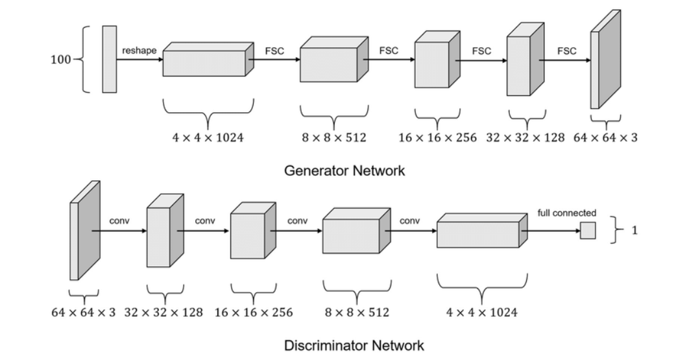
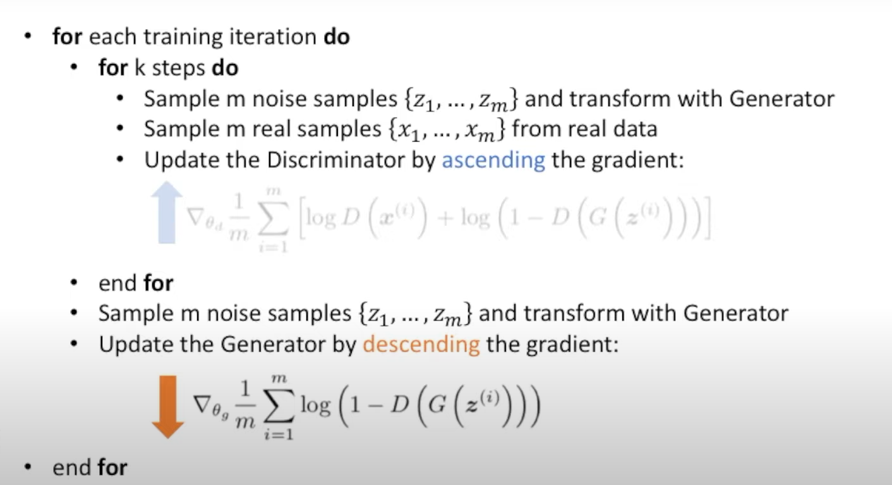

# DCGAN-Implementation
This repository contains a Python implementation of the DCGAN model introduced in the paper "UNSUPERVISED REPRESENTATION LEARNING WITH DEEP CONVOLUTIONAL GENERATIVE ADVERSARIAL NETWORKS"" 

- Citation - 
@misc{radford2015unsupervised,
    title={Unsupervised Representation Learning with Deep Convolutional Generative Adversarial Networks},
    author={Alec Radford and Luke Metz and Soumith Chintala},
    year={2015},
    eprint={1511.06434},
    archivePrefix={arXiv},
    primaryClass={cs.LG}
}

**NOTES**-

1. The first layer of the GAN, which takes a uniform noise distribution Z as input, could be called fully connected as it is just a matrix multiplication, but the result is reshaped into a 4-dimensional tensor and used as the start of the convolution stack. For the discriminator, the last convolution layer is flattened and then fed into a single sigmoid output
2. Replace any pooling layers with strided convolutions (discriminator) and fractional-strided convolutions or convtranspose2d (generator).
3. Use batchnorm in both the generator and the discriminator.
4. Remove fully connected hidden layers for deeper architectures.
5. Use ReLU activation in generator for all layers except for the output, which uses Tanh.
6. Use LeakyReLU activation in the discriminator for all layers.

	 1. No pre-processing was applied to training images besides scaling to the range of the tanh activation function [-1, 1]. 
	 2. All models were trained with mini-batch stochastic gradient descent (SGD) with a mini-batch size of 128. 
	 3. All weights were initialized from a zero-centered Normal distribution with standard deviation 0.02. 
	 4. In the LeakyReLU, the slope of the leak was set to 0.2 in all models.
	 5. we used the Adam optimizer (Kingma & Ba, 2014) with tuned hyperparameters, learning rate  0.0002 .
	 

Evaluation-
To evaluate the quality of the representations learned by DCGANs for supervised tasks, we train on Imagenet-1k and then use the discriminator’s convolutional features from all layers, maxpooling each layers representation to produce a 4 × 4 spatial grid. These features are then flattened and concatenated to form a 28672 dimensional vector and a regularized linear L2-SVM classifier is trained on top of them.(This repo does not have validation implementation)

### Model Architecture

1. The input of generator will be 100 dimensional white noise, which will be passed through a feed forward layer, the output will be reshaped to (4,4,1024).
2. The output of the discriminator will be flattened out and then passed through a feed forward layer, the output will have 2 as its dimension, this will passed to a softmax.

## Dataset
A small file of dataset is uploaded containing 100 images.

## Training Loop

### Discriminator Training:

1. **Generate Fake Data:**
    - Generate fake data using the generator by feeding white Gaussian noise.
    - Assign label 0 (indicating fake) to the generated data.
    
2. **Real Data:**
    - Take an equal number of real data samples.
    - Assign label 1 (indicating real) to the real data.
    
3. **Calculate Discriminator Loss:**
    - Forward pass both real and fake data through the discriminator.
    - Calculate the binary cross-entropy loss for both real and fake data.
    
4. **Backpropagate and Update Discriminator:**
    - Backpropagate the total discriminator loss and update the discriminator's parameters.

### Generator Training:

The generator tries to minimize the error in the discriminator's ability to distinguish between real and fake data.

1. **Generate Fake Data Again:**
    - Generate new fake data using the generator by feeding white Gaussian noise.
    
2. **Calculate Generator Loss:**
    - Forward pass the new fake data through the discriminator.
    - Calculate the binary cross-entropy loss using the labels indicating real data (1).

3. **Backpropagate and Update Generator:**
    - Backpropagate the generator loss and update the generator's parameters.

Make sure to use the real labels when calculating the generator loss.

